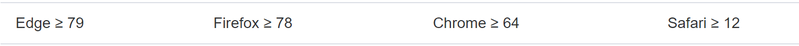

## SetUp

1. pnpm create vite
2. 安装@types/node 声明文件
3. 配置 vite.config.ts

- 环境变量通过 import.meta.env[key] 获取

4. 安装 jest

   - pnpm add -D jest @types/jest ts-jest ts-node
   - 如果配置了 tsconfig.json 的 include，编辑器还报红，重启一下 VScode

5. 引入 Element-plus

- 浏览器适用：
  
- .browserlistrc

- 如果使用的是 Volar，在 tsconfig.json types: [..., "element-plus/global"]
- 使用 Auto import
  - pnpm install -D unplugin-vue-components unplugin-auto-import
  - 配置 Vite.config.ts 插件
  - Global Element Configuration 按需设置
    - Type 'string' is not assignable to type 'BuildPropType<StringConstructor, "" | "default" | "small" | "large", unknown> | undefined'.
    - size: BuildPropType<StringConstructor, "" | "default" | "small" | "large", unknown>
